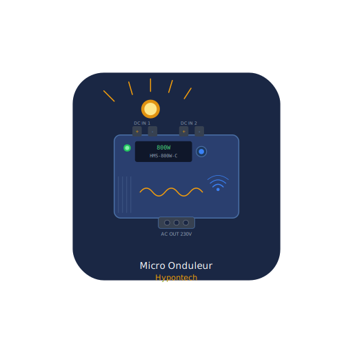

  

# Micro Onduleur Hypontech 🌞

Intégration Home Assistant complète pour les micro-onduleurs **Hypontech HMS-800W-C**.

Inclut toutes les données globales **plus** le suivi par panneau individuel.

## ✨ Fonctionnalités

- 📊 Toutes les données globales de production
- 🔲 Suivi **par panneau individuel** (pv1, pv2, pv3, pv4)
- 🔋 Détection automatique de la **batterie**
- ⚡ Détection automatique des **onduleurs 4 entrées**
- 🌙 Gestion intelligente **nuit/jour** — pas d'appel API inutile la nuit
- 🔄 Mise à jour toutes les **60 secondes** (30 minutes la nuit)
- 📅 Production mois/année mise à jour **1 fois par heure**
- 🔑 **Réauthentification automatique** si le mot de passe change
- 🛡️ Conservation des dernières données en cas d'erreur API

## Installation via HACS

1. Dans HACS → cliquez sur ⋮ → **Dépôts personnalisés**
2. Ajoutez : `https://github.com/frederic76430/micro-onduleur-hypontech`
3. Type : **Intégration**
4. Cherchez **"Micro Onduleur Hypontech"** et installez
5. Redémarrez Home Assistant
6. **Paramètres → Appareils & Services → + Ajouter → "Micro Onduleur Hypontech"**
7. Entrez votre email et mot de passe **hypon.cloud**

## Capteurs disponibles

### 📊 Données globales
| Capteur | Unité | Activé par défaut |
|---------|-------|:-----------------:|
| Production aujourd'hui | kWh | ✅ |
| Production totale | kWh | ✅ |
| Production ce mois | kWh | ✅ |
| Production cette année | kWh | ✅ |
| Production instantanée | W | ✅ |
| CO2 économisé | kg | ✅ |
| Arbres équivalents | | ✅ |
| Puissance solaire | W | ❌ |
| Puissance réseau | W | ❌ |
| Puissance batterie | W | 🔋 auto |
| Batterie | % | 🔋 auto |

### 🔲 Données par panneau
| Capteur | Unité | Activé par défaut |
|---------|-------|:-----------------:|
| Panneau 1 - Puissance | W | ✅ |
| Panneau 1 - Tension | V | ✅ |
| Panneau 1 - Courant | A | ✅ |
| Panneau 2 - Puissance | W | ✅ |
| Panneau 2 - Tension | V | ✅ |
| Panneau 2 - Courant | A | ✅ |
| Panneau 3 - Puissance | W | ⚡ auto |
| Panneau 3 - Tension | V | ⚡ auto |
| Panneau 3 - Courant | A | ⚡ auto |
| Panneau 4 - Puissance | W | ⚡ auto |
| Panneau 4 - Tension | V | ⚡ auto |
| Panneau 4 - Courant | A | ⚡ auto |
| Puissance totale DC | W | ❌ |
| Tension AC réseau | V | ✅ |
| Fréquence réseau | Hz | ✅ |
| Température onduleur | °C | ✅ |

> 🔋 **auto** = activé automatiquement si une batterie est détectée
> ⚡ **auto** = activé automatiquement si un onduleur 4 entrées est détecté
> ❌ = désactivé par défaut, activable manuellement

## Compatibilité
- Testé avec : **Hypontech HMS-800W-C**
- Cloud : **hypon.cloud**
- Mise à jour : toutes les **60 secondes** (30 min la nuit)
- Home Assistant : **2024.1.0** minimum

## Historique des versions

### v1.0.8
- Architecture améliorée — classe de base `entity.py`
- Logger centralisé dans `const.py`
- Réauthentification automatique si mot de passe change
- Gestion des erreurs inconnues

### v1.0.6
- Mise à jour toutes les 60 secondes (au lieu de 5 minutes)
- Production mois/année mise à jour 1 fois par heure seulement
- Gestion intelligente nuit/jour

### v1.0.5
- Détection automatique batterie
- Détection automatique onduleur 4 entrées (pv3/pv4)
- "Consommation maison" renommé en "Production instantanée"

### v1.0.1
- Correction production ce mois
- Correction production cette année
